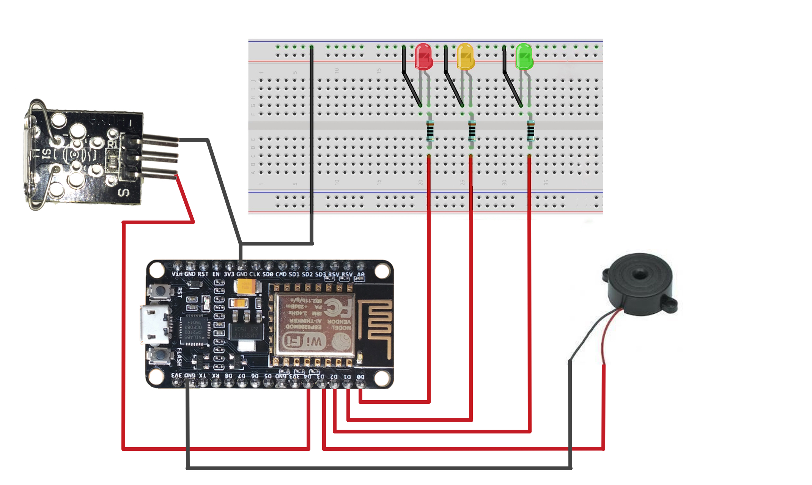
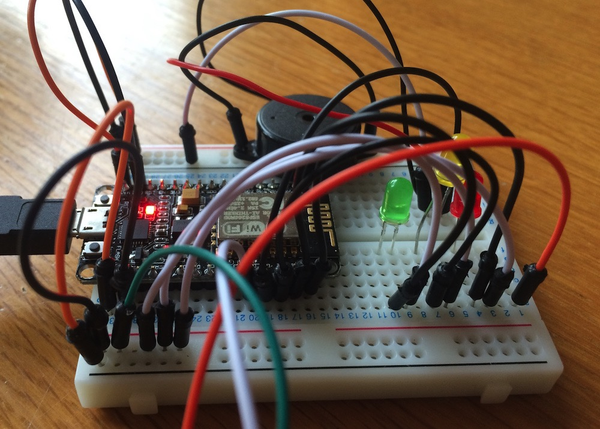
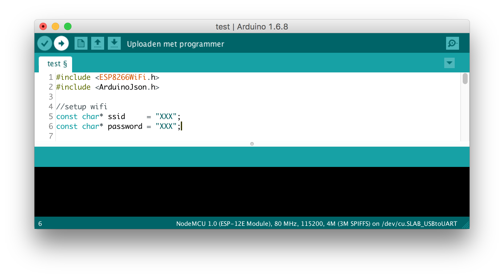

# How to create a alarm that will go of if the door stays open?
If the door stay's open in the winter it will be cold in the house. In this tutorial I will explane how I create a alarm that will go off if the door is open for to long ago. 

## Hardware

### Requrements
For this project you need some stuf. Overhere is a list of thing I've uses for this project.

- 1 NodeMCU (with WiFi)
- 1 green led
- 1 red led
- 1 breadboard
- A amount of wires 
- Piezo-zoemer
- Magnet sensor
- USB to Micro-USB B cable (to connect NodeMCU to pc)

### connecting 
Over here you can see a sheme how to connect the NodeMCU to the senors and the LED's. Connect them on this way. 


Picture of my sheme

| Sensor/Output  | Port         | 
| ------------- |:-------------:| 
| green led     | D0 			  | 
| orange led    | D1			  | 
| red led       | D2 			  | 
| Piezo-zoemer  | D3 			  | 
| sensor        | D4 			  | 


Picture of my setup 

## Installing NodeMCU
### Software Requrements 
- Arduino app
- [ArduinoJson lib](https://github.com/bblanchon/ArduinoJson)
- [ESP8266WiFi lib](https://github.com/ekstrand/ESP8266wifi)

### Set up
When you have connected all the wires you can connect the NodeMCU to your PC. Before we can upload our code you need to download [ArduinoJson](https://github.com/bblanchon/ArduinoJson) and [ESP8266WiFi](https://github.com/ekstrand/ESP8266wifi) libary's. And place them in the ```arduino/libarys``` folder. Now the Arduino IDE can use them.

### Open app
- Open the Arduino app (You can download it here [Arduino](http://arduino.com)).  
- Open ```/arduino/projects/closethedoor/closethedoor.ino``` file from the this repository.
- Change the WiFi settings. 

```
const char* ssid     = "XXX";
const char* password = "XXX;
```

- Change the path to  where you will host your website. 

```
const char* host        = "iot.dolstra.me"; // Your domain
String getPath          = "/api/status";
String postPath         = "/api";
const int httpPort      = 80;
```

- Upload the code to your NodeMCU with the button on the top of the app.



Now your NodeMCU will connect to your WiFi.*  And it will try to get and post to your server. 


## Installation server 

## Software Requrements 
- Nodejs
- gulp global installed
- npm global installed


## Download and setup
In the server folder you can find the code for the server.

Download:
[github.com/mat1th/close-the-door/archive/master.zip](https://github.com/mat1th/close-the-door/archive/master.zip)

Go to the project:

```bash
cd path/to/files
```

Install node modules:

```bash
npm install
```

## Building

Install Gulp:

```bash
npm install --global gulp-cli
```

Start Gulp:

```bash
gulp
```

## Starting the app

Start the app:

```bash
npm start
```
Now the server will run on your desktop localy. If you would like to acces the server from oudsite you need to install it on a server. Or port forwart it in your router. 


## Code structure
In the ```app.js``` file you can find the start file from the app. for every route is a file in the  ```routes/file.js```. If there is a post request to the server it will store the data in the  ```resources/doorStatus.js```.

```
/server
  /methods
    /getstatus.js     -> returns the status op the leds based on the current time.
    /methods.js       -> returns the to the last object of a array
    /time.js          -> returns the time between the last object and now
  /public             
    /src              -> all css/js/img fils  
    /dist             -> files combined with gulp (you can client side only can get here)
  /resources          
    /data.json        -> stores the costum LEDs status
    /doorStatus.json  -> stores the history of the doorStatus
    /settings.json    -> stores the setting
  /routes
    /api.js           -> the api route with al get and posts
    /index.js         -> the home page
    /settins.js       -> the settings page with a post and get
    /status.js        -> status page with a post and get
  /views
    /error.hbs        -> if you get a route or a error you will see this page
    /home.hbs         -> the home page from the app with the status and the graph
    /layout.hbs       -> the base layout form the app with the footer and header
    /settins.hbs      -> the settings page with a from to change the settings
    /status.hbs       -> the status page with a form to add a costum status
  /app.js

```


## API
My app has a API where you can get the realtime data.

### Current status
You can get the last status from my sensor from [iot.dolstra.me/api/status](http://iot.dolstra.me/api/status/). You will get the status of the LED's, alarm and the status of the door.

```json
    {
      "time": "2016-04-21 15:53:07",
      "doorStatus": 1,
      "status": "closed",
      "alarm": false,
      "redLed": false,
      "orangeLed": false,
      "greenLed": true
    }
```

### History
You can also get the history data from [iot.dolstra.me/api/data](http://iot.dolstra.me/api/data). You will get a array with the time and door status.

```json
    [{
      "time": "2016-04-21 18:52:02",
      "doorStatus": "1"
    }]
```

### Post a status for the LED's
If you wan't to change the status of the LED's you can post to [iot.dolstra.me/status](http://iot.dolstra.me/status). The post sting must be:

```
    greenLed=true&orangeLed=true&redLed=true&alarm=true
```


## Live URL
[Zie live](http://iot.dolstra.me


## Issues
*If your NodeMCU won't connect please try a other network or disable the password from the network.  

## Made by
[Matthias Dolstra](https://dolstra.me)
