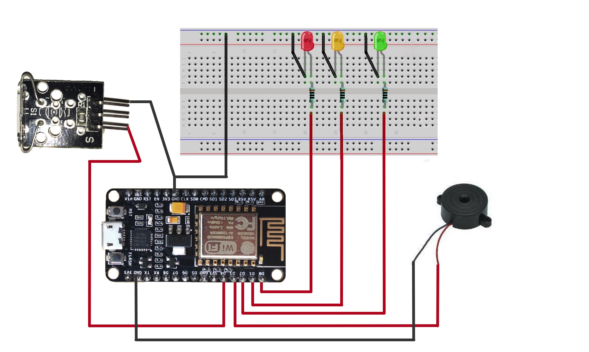
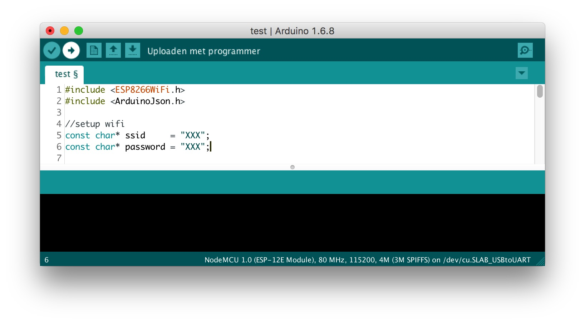
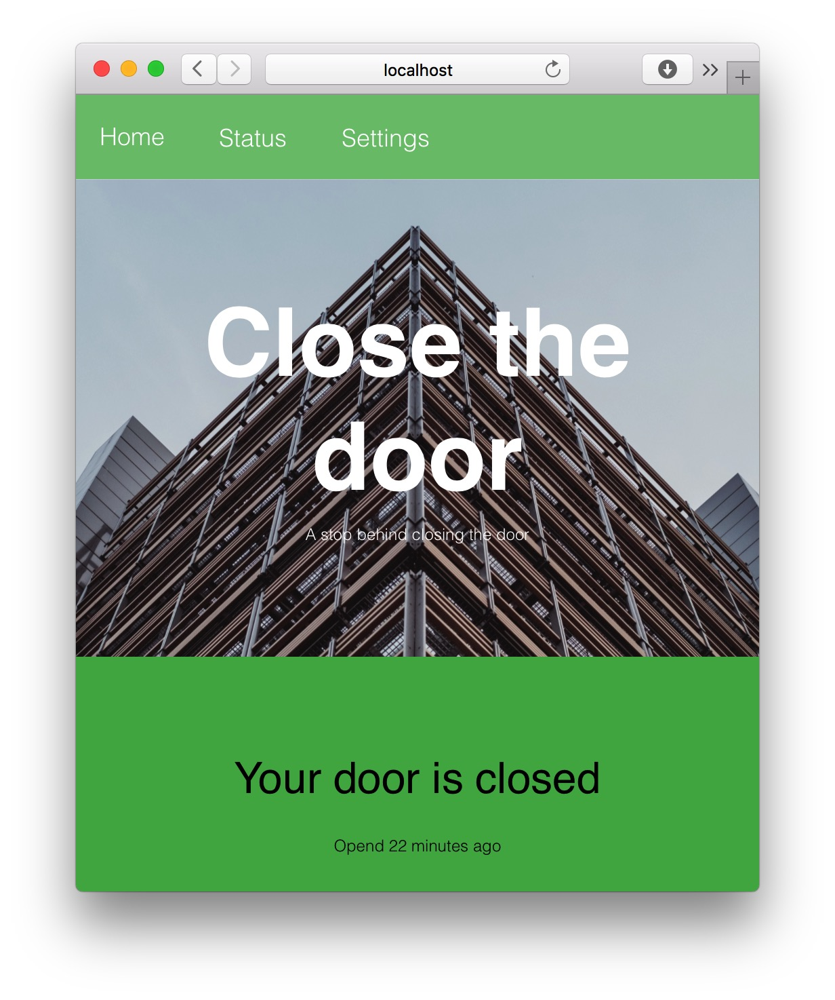
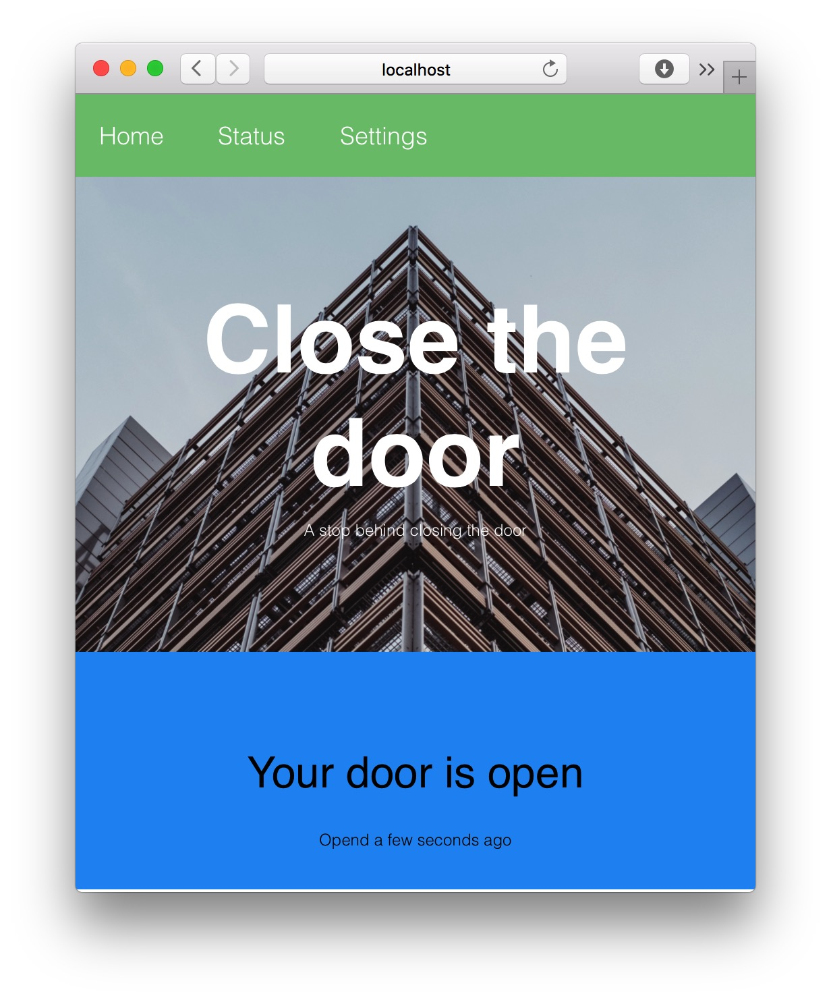
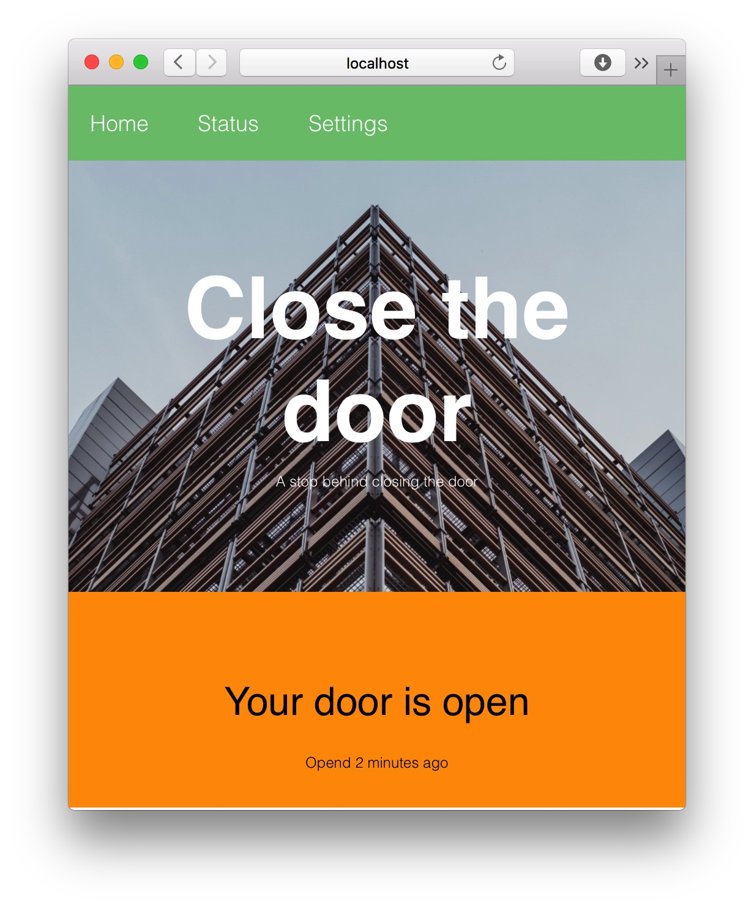
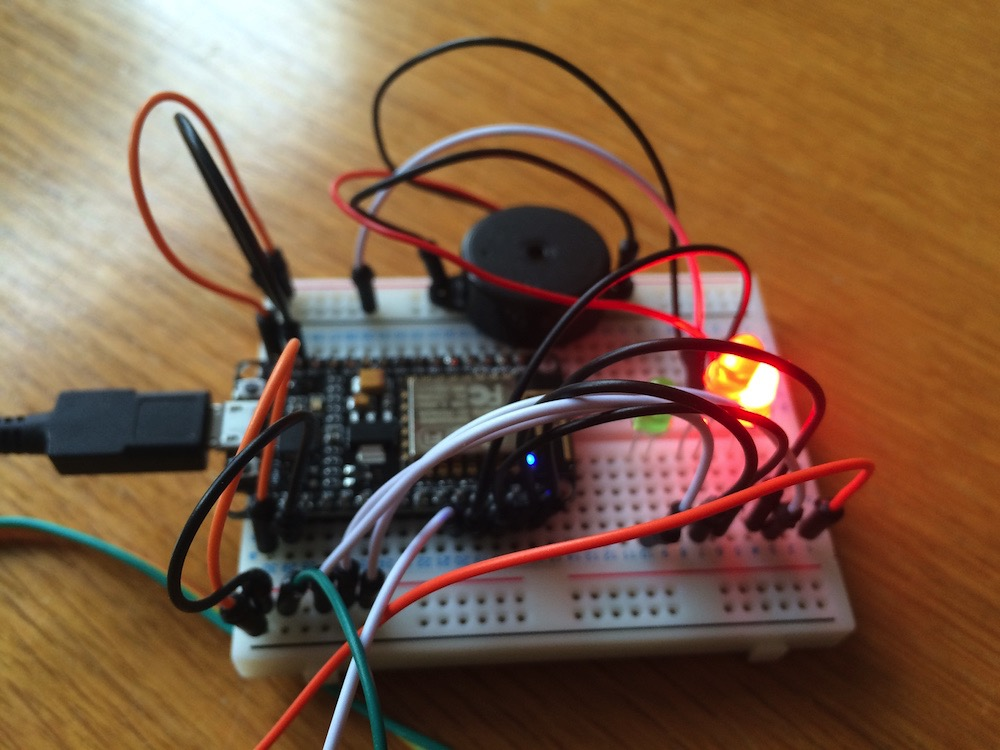
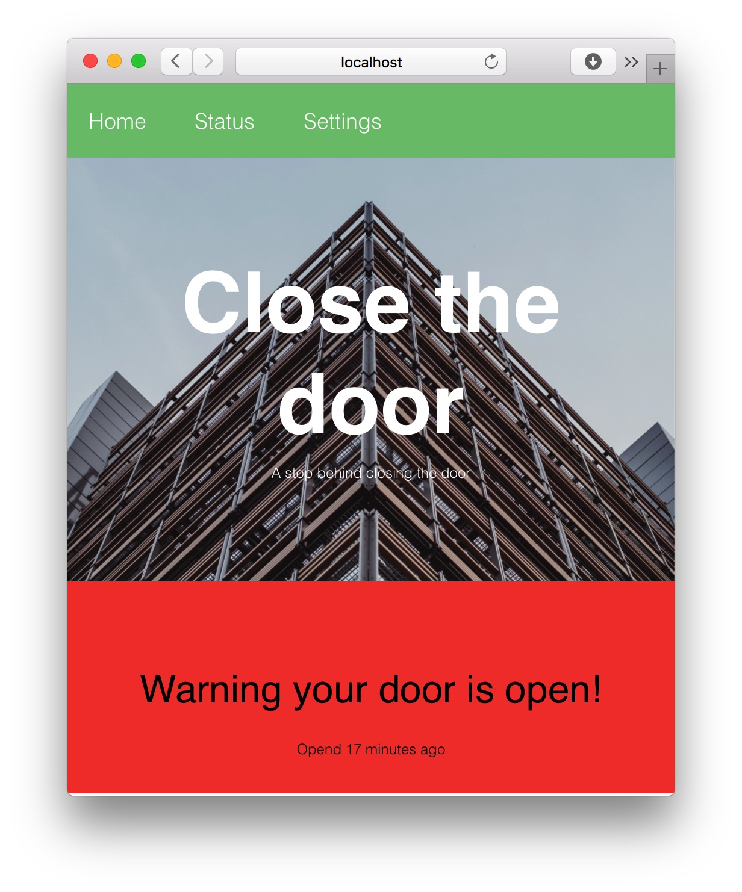

# How to create an alarm that will go off if the door stays open?
If the door stay's open in the winter it will be cold in the house. In this tutorial, I will explain how I create an alarm that will go off if the door is open for too long. The alarm has 3 phases. The first phase there is nothing wrong. The second an orange led will turn on and the third phase where a red led will turn on with an alarm. On the server, you can configure how long each phase should be. 

## Hardware

### Requirements
For this project, you need some stuff. Over here is a list of thing I've used for this project.

- 1 NodeMCU (with WiFi)
- 1 green led
- 1 red led
- 1 breadboard
- An amount of wires 
- Piezo-zoomer
- Magnet sensor
- USB to Micro-USB B cable (to connect NodeMCU to PC)

### connecting 
Over here you can see a scheme how to connect the NodeMCU to the senors and the leds. Connect them on this way. 


Picture of my sheme

| Sensor/Output  | Port         | 
| ------------- |:-------------:| 
| green led     | D0            | 
| orange led    | D1            | 
| red led       | D2            | 
| Piezo-zoemer  | D3            | 
| sensor        | D4            | 


Picture of my setup 

## Installing NodeMCU
### Software Requrements 
- Arduino app
- [ArduinoJson lib](https://github.com/bblanchon/ArduinoJson)
- [ESP8266WiFi lib](https://github.com/ekstrand/ESP8266wifi)

### Set up
When you have connected all the wires you can connect the NodeMCU to your PC. Before we can upload our code you need to download [ArduinoJson](https://github.com/bblanchon/ArduinoJson) and [ESP8266WiFi](https://github.com/ekstrand/ESP8266wifi) libarys. And place them in the ```arduino/libarys``` folder. Now the Arduino IDE can use them.

### Open app
- Open the Arduino app (You can download it here [Arduino](http://arduino.com)).  
- Open ```/arduino/projects/closethedoor/closethedoor.ino``` file from  this repository.
- Change the WiFi settings. 

```
const char* ssid     = "XXX";
const char* password = "XXX;
```

- Change the path to  where you will host your website. 

```
const char* host        = "iot.dolstra.me"; // Your domain
String getPath          = "/api/status";
String postPath         = "/api";
const int httpPort      = 80;
```

- Upload the code to your NodeMCU with the button on the top of the app.



Now your NodeMCU will connect to your WiFi.*  And it will try to get and post to your server. 

## Code structure NodeMCU
On top of the app, I've defined all the vars and pins. In the void setup, I connect all pins and connect to the wifi network. Over here you can see how to connect.  

```arduino
  WiFi.begin(ssid, password); //start the connection
  int wifi_ctr = 0;
  while (WiFi.status() != WL_CONNECTED) { //while connection print a dot
    delay(500);
    Serial.print(".");
  }
```

In the void loop, i read the sensor pin and I fist get the data and then Post the sensor value. In the GET, I check every value of the JOSN object. 

```arduino
   if (strcmp(json_parsed["greenLed"], "true") == 0) {
        digitalWrite(greenLedPin, HIGH);
      }
```

In the POST, I create the headers and send the posstring. 

```arduino
    String postStr = "doorStatus="; // create the post sting 
    postStr += String(sensorValue);
```


## Installation server 

### Software Requirements 
- Nodejs
- gulp global installed
- npm global installed


### Download and setup
In the server folder, you can find the code for the server.

Download:
[github.com/mat1th/close-the-door/archive/master.zip](https://github.com/mat1th/close-the-door/archive/master.zip)

Go to the project:

```bash
cd path/to/files
```

Install node modules:

```bash
npm install
```

### Building

Install Gulp:

```bash
npm install --global gulp-cli
```

Start Gulp:

```bash
gulp
```

### Starting the app

Start the app:

```bash
npm start
```
Now the server will run on your desktop locally. If you would like to access the server from outside you need to install it on a server. Or port forward it in your router. 

## Status 
There are several statuses in the app. The first status is that the door is closed. On the home page, you will see a green bar. On the NodeMCU, the green Led will be on. 



If your door is open the bar will be blue. The green Led will be on.




When the door is open for X min the led will be orange, so will the layout also be. 




If the door is open for x time the red LED will turn on and the alarm will go on. When you close the door the page will be green again.



## Code structure server
In the ```app.js``` file you can find the start file from the app. for every route is a file in the  ```routes/file.js```. If there is a post request to the server it will store the data in the  ```resources/doorStatus.js```.

```
/server
  /methods
    /getstatus.js     -> returns the status op the leds based on the current time.
    /methods.js       -> returns the to the last object of a array
    /time.js          -> returns the time between the last object and now
  /public             
    /src              -> all css/js/img fils  
    /dist             -> files combined with gulp (you can client side only can get here)
  /resources          
    /data.json        -> stores the costum LEDs status
    /doorStatus.json  -> stores the history of the doorStatus
    /settings.json    -> stores the setting
  /routes
    /api.js           -> the api route with al get and posts
    /index.js         -> the home page
    /settins.js       -> the settings page with a post and get
    /status.js        -> status page with a post and get
  /views
    /error.hbs        -> if you get a route or a error you will see this page
    /home.hbs         -> the home page from the app with the status and the graph
    /layout.hbs       -> the base layout form the app with the footer and header
    /settins.hbs      -> the settings page with a from to change the settings
    /status.hbs       -> the status page with a form to add a costum status
  /app.js

```


## API
My app has an API where you can get the realtime data.

### Current status
You can get the last status from my sensor from [iot.dolstra.me/api/status](http://iot.dolstra.me/api/status/). You will get the status of the LED's, alarm and the status of the door.

```json
    {
      "time": "2016-04-21 15:53:07",
      "doorStatus": 1,
      "status": "closed",
      "alarm": false,
      "redLed": false,
      "orangeLed": false,
      "greenLed": true
    }
```

### History
You can also get the history data from [iot.dolstra.me/api/data](http://iot.dolstra.me/api/data). You will get an array with the time and door status.

```json
    [{
      "time": "2016-04-21 18:52:02",
      "doorStatus": "1"
    }]
```

### Post a status for the LED's
If you want to change the status of the LED's you can post to [iot.dolstra.me/status](http://iot.dolstra.me/status). The post sting must be:

```
    greenLed=true&orangeLed=true&redLed=true&alarm=true
```


## Live URL
[Zie live](http://iot.dolstra.me)


## Issues
*If your NodeMCU won't connect please try another network or disable the password from the network.  

## Made by
[Matthias Dolstra](https://dolstra.me)
